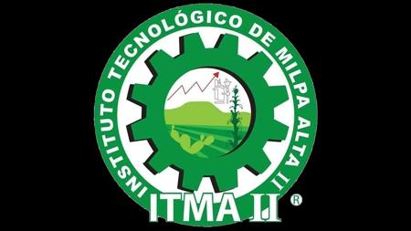

**Instituto Tecnológico de Milpa Alta II**

**Materia:** Fundamentos de Ingeniería de Software  
**Docente:** Roldán Aquino Segura

**Equipo: Ingeniebrios (Papelería)**  
Edgar Salazar López  
César Meza Corella  
Misael Silva Fragoso  
Marco Antonio Aguilar Guerrero  

---

# Reporte de Análisis: Funcionamiento del Negocio y Análisis de Requerimientos

## 1. Investigación Previa

La papelería es una pieza fundamental en cualquier entorno de oficina, hogar o escuela. Ya sea que usted sea propietario de un negocio, gerente de oficina o simplemente alguien que busca abastecer su espacio de trabajo, comprender qué implica una papelería y qué productos puede ofrecerle es esencial. En esta guía, le proporcionaremos toda la información necesaria sobre papelería y suministros de oficina para que tome decisiones informadas y eficientes.

### ¿Qué es una papelería?
Una papelería es un establecimiento comercial especializado en la venta de productos y artículos de oficina, escolares y de papelería en general. Estos productos incluyen papel, bolígrafos, carpetas, y muchos otros suministros esenciales para el día a día en oficinas, escuelas y hogares. Las papelerías también pueden ofrecer artículos más especializados como equipos de oficina, materiales artísticos y productos técnicos. En resumen, una papelería es el lugar donde se puede encontrar todo lo necesario para el trabajo, el estudio y las actividades creativas.

### Tipos de papelería y Productos
Existen diversos tipos de papelerías, cada una adaptada a diferentes necesidades:
- **Papelería escolar:** Ofrece todo lo que los estudiantes necesitan. Desde cuadernos y lápices en varios estilos hasta mochilas robustas y carpetas de archivo.
- **Papelería de oficina:** Artículos como papel para impresora (en varias calidades), organizadores, bolígrafos y equipo indispensable como grapadoras.
- **Papelería técnica:** Productos para profesionales que requieren alta precisión como papel milimetrado, compases, papel vegetal y plantillas de dibujo.

Al visitar una papelería, es útil tener una lista de los artículos imprescindibles o suministros de organización, materiales de arte y manualidades, asegurando obtener todo lo necesario en un solo establecimiento en pro de la gestión eficiente. Las empresas dedicadas a esto ofrecen también precios competitivos, variedad y servicio al cliente de calidad.

---

## 2. Metodología: ¿Cómo se llegó a las preguntas de la entrevista?

Para comprender a fondo el funcionamiento interno y la operativa de este negocio en particular, la investigación previa nos brindó una base teórica de lo que "debería" tener y vender una papelería general (stock, clasificaciones). Sin embargo, era primordial aterrizar esos conceptos a la realidad del establecimiento para descubrir cuáles son las *reglas* invisibles bajo las que operan.

Las preguntas de la entrevista se diseñaron para mapear la rutina de trabajo en cuatro pilares, conectando la teoría con la práctica:

1. **Flujo de Ventas y Atención al Cliente:** Investigar si hay pasos estandarizados que el sistema deba imitar. Por ello se preguntó "¿Cómo se realiza una venta?".
2. **Registro y Control de Inventario:** Sabiendo el enorme volumen de artículos (escolares, oficina, técnica), necesitábamos saber cómo evitan el desabasto y cómo capturan entradas/salidas de dinero.
3. **Gestión de Excepciones:** Preguntas sobre devoluciones y trámites tardados para identificar "cuellos de botella" y escenarios imprevistos que un software debe facilitar.
4. **Viabilidad Tecnológica:** Preguntar su opinión sobre usar un software para asegurar que el diseño sea adecuado a su infraestructura, que descubrimos está fuertemente inclinada a la accesibilidad desde un teléfono celular.

---

## 3. Entrevista Realizada

A continuación se presentan las preguntas, y las respuestas recolectadas por medio del cuestionario que el equipo elaboró:

**¿Cómo se realiza una venta desde que llega el cliente hasta que paga?**
Primero abordamos con un saludo y brindamos el servicio o producto que quiere el cliente. Y al finalizar su elección, procedemos al pago y ya.

**¿Las ventas se registran manualmente o en algún sistema?**
Manualmente.

**¿Qué información registran en cada venta (producto, cantidad, precio, fecha, cliente)?**
Precio.

**¿Manejan diferentes formas de pago? (efectivo, transferencia, tarjeta)**
Diferentes.

**¿Existen descuentos o promociones? ¿Bajo qué condiciones se aplican?**
Por producto.

**¿Qué sucede cuando un cliente quiere devolver un producto?**
Se checa que vengan en buen estado y sin problema.

**¿Cómo registran los productos que tienen en la papelería?**
Un aproximado global.

**¿Cómo saben cuándo un producto se está terminando?**
Visualmente.

**¿Cómo registran la entrada de nuevos productos?**
Visualmente.

**¿Tienen productos más vendidos o prioritarios?**
Impresiones.

**¿Qué proceso les toma más tiempo?**
Trámites escolares o de gobierno.

**¿Les gustaría usar un sistema digital? ¿Para qué funciones?**
Ok en celular.

**¿Qué pasa si un producto llega dañado?**
Se cambia con proveedor.

---

## 4. Análisis del Funcionamiento y Reglas de Negocio

A partir del análisis conjunto entre la investigación previa y la entrevista en sitio, se identificaron las siguientes reglas fundamentales que rigen la operación diaria del negocio:

1. **Atención al cliente y proceso de venta:** El trato es directo y rápido. Toda venta debe iniciar saludo, y finaliza con el cobro. No se documenta inventario durante la venta, el único dato que trasciende y se guarda es el **precio de la venta**.
2. **Manejo Financiero y Descuentos:** Se aceptan múltiples métodos de pago. Las políticas de descuentos no se basan en volumen total o clientes frecuentes, sino estrictamente amarradas a promociones **por producto**.
3. **Flujo de Inventario Sensorial:** Todo el control de stock, alarmas de reabastecimiento y cálculo de disponibilidad operativa dependen 100% de la **revisión visual** y cálculo de aproximados globales por parte del encargado, representando una fuerte área de modernización. 
4. **Política de Garantías y Daños:** Se permite la devolución post-venta si todo viene en el estado entregado. Sin embargo, las mermas directas desde el proveedor se detienen y cambian directo sin entrar en inventario al público, mitigando las pérdidas en el inventario.
5. **Enfoque de Prioridad y Productividad:** El producto "estrella" es el servicio de *impresiones* (alto movimiento), mientras que el recurso más escaso de los empleados y el que más cuellos de botella les provoca es el auxilio en los *trámites escolares y servicios de gobierno directos*.
6. **Expectativa y Perfil del Sistema Digital:** Detrás de cámaras, el dueño nos comentó que ya había trabajado con un software de punto de venta, pero lo que no le gustó fue que ralentizaba todos los procesos que él hacía, cuando debería ser lo contrario. Por ello, como regla principal de viabilidad, cualquier solución tecnológica a incorporar debe ser simplificada en interfaz y completamente compatible para operar de forma nativa desde un **teléfono celular**. Aunque no descarta tenerlo en escritorio, prefiere que todo esté en la interfaz de un celular por ser más práctico.
